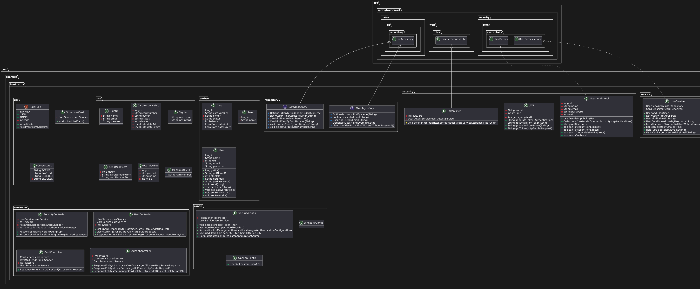
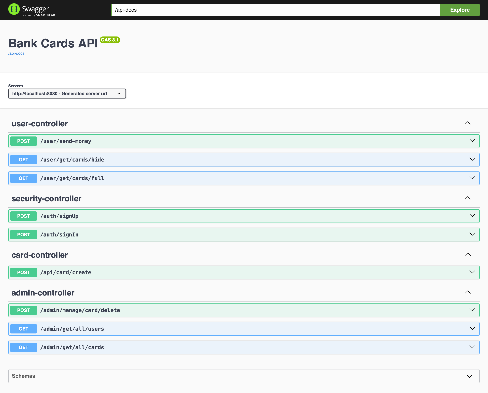

# Документация по проекту

### Технологии и стек

## Установка

1. Клонирование репозитория

       git clone https://github.com/kekich119/bank-card

2. Переход в директорию

       cd bank-card

3. Создание исполняемого файла

       mvn package

4. Поднятие базы данных

       docker-compose up

если что-то идёт не так, то воспользуйтесь

    alt-docker-compos.yml

5. Переход в директорию в jar файлом

       cd target

6. Запуск проекта

       java -jar bank_rest-main-0.0.1-SNAPSHOT.jar

## Структура проекта

## Api

## Описание проекта
Этот проект представляет из себя REST приложение банка.
Его функции - создание и вход в аккаунт, обеспечение безопасности через JWT токен, создание карт, распределение на роли ADMIN и USER и многое другое что вы можете найти по api выше

## Возможные улучшения

Добавление большей валидации и подтверждение почты по письму на email

## Масштабирование

Возможно расширение на микросервисы

